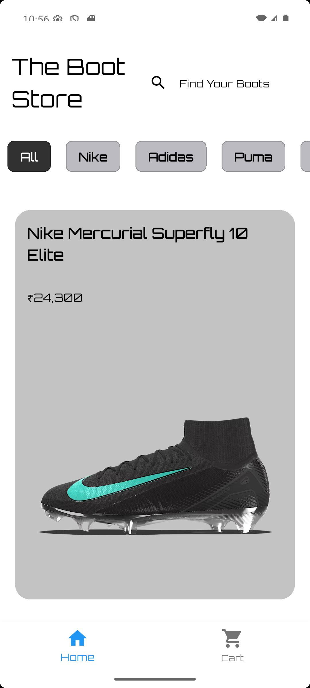
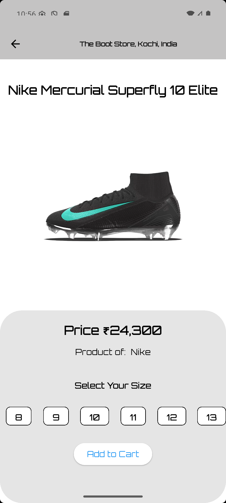
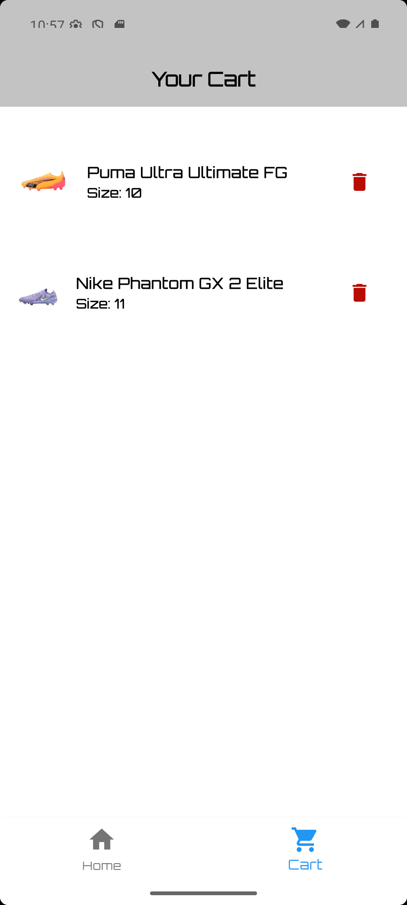

# 🛒 E-Mart - Modern Flutter E-Commerce App

A clean, functional, and modern **E-Commerce Mobile Application** built with **Flutter and Dart**, simulating a real-world shopping experience. The app enables users to browse products, view detailed product information, add items to the shopping cart, and manage their purchases effortlessly. With a visually appealing design and smooth navigation, E-Mart delivers an enhanced online shopping experience on both Android and iOS platforms.

---

## 📱 Preview

| Home Page | Product Details |
|:--------:|:--------------:|
|  |  |

| Cart Page | Live Demo |
|:--------:|:--------:|
|  |  |

---

## 🚀 Features

🔍 **Hero Section:**  
A dynamic and engaging hero banner at the top of the home page to capture user attention.

🛍️ **Product Listings:**  
Display a list of products using Flutter widgets like `ListView.builder`, showcasing images, names, and prices.

📄 **Product Detail View:**  
Each product has a detailed page showing descriptions, prices, and an option to add to the shopping cart.

🛒 **Shopping Cart Functionality:**  
Fully functional cart page where users can:
- Add and remove products
- View total price calculation
- Remove individual items or clear the cart completely

💾 **State Management:**  
Efficient use of Flutter state management (`setState`) to dynamically update the cart and product views.

🌗 **Light & Dark Mode Support:**  
Switch between beautiful Light and Dark themes to enhance user experience.

📱 **Responsive UI:**  
Optimized layout for a smooth user experience across different screen sizes and orientations.

🧩 **Reusable Widgets:**  
Well-structured and modular Dart code using custom widgets for scalability and code maintainability.

---

## 🛠️ Technologies Used

- **Flutter** – Cross-platform UI toolkit
- **Dart** – Programming language for Flutter development
- **Material Design** – Flutter's built-in design system
- **State Management** – Flutter's `setState` for dynamic UI updates
